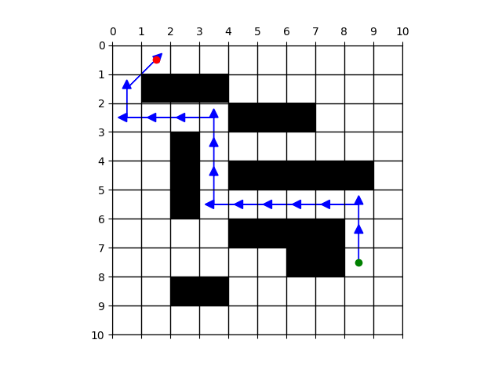

# Path Planning Project - Module 1

This project implements and compares multiple path planning algorithms: **Breadth-First Search (BFS)**, **Dijkstra**, and **Rapidly-exploring Random Tree (RRT)** on grid maps. The code reads maps and start-goal pairs, computes paths, evaluates performance, and visualizes the results.

<!-- include images and align in center-->


---

## Project Structure

```
├── path_planner.py          # Main execution file
├── utils.py                 # Planing algorithm and utility function implementations
├── grid_files               # Occupancy grid map files (e.g., grid1.txt, grid2.txt, grid3.txt)
├── start_goal               # Contains JSON files with start-goal pairs
├── Images                   # Output images of planned paths
└── README.md                # This file
```

---

## Requirements

- Python 3.10
- matplotlib
- numpy

Install the dependencies:
```bash
pip install matplotlib numpy
```

---

## How to Run

1. Update the grid.txt and start_goal.json file paths in the path_planner.py code.
Example:
```python
grid_path = "./grid3.txt"
start_goal_path = "./startgoal3.json"
```
3. Run the script:
```bash
python3 path_planner.py
```

---

## Output

For each start-goal pair and each algorithm:
- Execution time is printed
- Memory usage is printed
- Path length is computed and displayed
- A plot is saved as `{planner}_grid_{map_num}_startgoalpair_{start_goal_num}.png`, etc.

---

## Notes
- The robot is assumed to be circular with a diameter of 1 meter
- The grid cells are also 1m x 1m
- Diagonal movements (8-connected) are supported

---

## Credits
Developed as part of the Module 1 project for Advanced Navigation Course at WPI.
